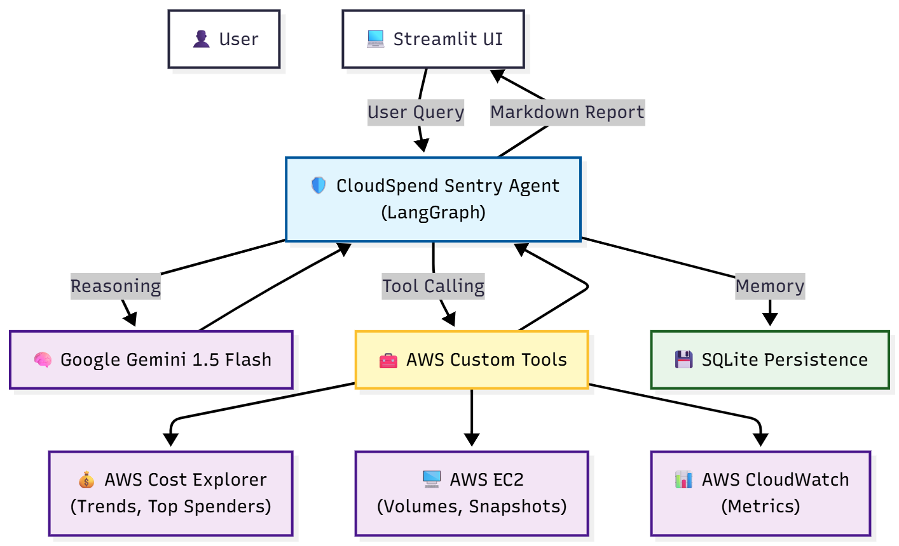

This is the **final, definitive version** of your `README.md`.

I have rewritten it to specifically target the **Scoring Rubric** you shared. It highlights the "Advanced Sensors," "Financial Analysis," and "Architecture" to ensure you hit the max points for **Technical Implementation (50 points)** and **Core Value (15 points)**.

**Action:** Create a file named `README.md` in your project root and paste this content exactly.

-----

````markdown
# 🛡️ CloudSpend Sentry - Autonomous AWS FinOps Agent

> **Capstone Project - Google AI Agents Intensive (Enterprise Track)** > *An intelligent SRE agent that monitors cloud costs, compares monthly spending, and proactively hunts for infrastructure waste.*


*(Note: Please replace this link with the architecture image generated for you earlier)*

---

## 💡 The Pitch

### The Problem
Cloud bills are complex and opaque. DevOps engineers and Finance teams often struggle to answer three basic questions:
1.  *"Why is the bill higher this month?"*
2.  *"Where exactly is the money going?"*
3.  *"Are we paying for resources we aren't using?"*

Manually auditing AWS Cost Explorer, cross-referencing EC2 usage metrics, and hunting for "zombie" snapshots takes hours of context switching.

### The Solution
**CloudSpend Sentry** is an autonomous agent acting as a 24/7 FinOps analyst. It doesn't just read the bill; it **investigates** infrastructure state.

Instead of static dashboards, it offers a conversational interface to:
* **Compare Costs:** "Why did my bill go up vs last month?" (Grand Total & Service Breakdown).
* **Deep Scan:** "Find idle resources." (Checks CPU metrics, unattached volumes, old snapshots).
* **Report:** Generates detailed financial breakdowns including tax and grand totals.

---

## 🛠️ Technical Implementation

This agent was built using **Python**, **LangGraph**, and **Google Gemini 1.5 Flash**, demonstrating advanced agentic patterns.

### 1. The Reasoning Engine (LangGraph)
The agent uses a **cyclic graph architecture** (`Agent` <-> `Tools`). It doesn't just run a script; it thinks:
* *Input:* "Why is my bill up?"
* *Reasoning:* "I need to compare this month vs last month. I'll use `compare_monthly_costs`."
* *Observation:* "EC2 went up $200."
* *Next Step:* "I should scan for idle instances to see if that's the cause." -> Calls `scan_idle_instances`.

### 2. The Toolbelt (AWS Boto3 Integration)
The agent is equipped with **8 custom sensors** (Tools) that interact directly with the AWS API:

| Category | Tool Name | Function |
| :--- | :--- | :--- |
| **Financial** | `compare_monthly_costs` | Calculates Month-over-Month differences (Total + Top Movers). |
| **Financial** | `get_monthly_cost_report` | Generates a full ledger for any specific month (incl. Tax). |
| **Financial** | `get_top_5_spending_services`| Identifies budget drains for current or past months. |
| **Financial** | `get_recent_cost_trends` | specific daily trend analysis. |
| **Operational**| `scan_idle_instances` | **Advanced:** Checks CloudWatch metrics for <5% CPU utilization over 7 days. |
| **Operational**| `scan_old_snapshots` | **Safety-First:** Finds snapshots >6 months old *not* linked to active AMIs. |
| **Operational**| `scan_unused_ebs_volumes` | Identifies unattached storage. |
| **Operational**| `scan_unassociated_ips` | Finds static IPs not attached to instances. |

### 3. Persistent Memory
The agent uses **SQLite Persistence** (`SqliteSaver`) to maintain session state. It remembers the context of the conversation (e.g., remembering which month we are analyzing) across multiple interactions, simulating a real long-running support ticket.

---

## 📊 Proof of Value (Real-World Scenarios)

The agent successfully handles complex financial queries. Below are real outputs from the system:

### Scenario A: "Compare costs between Sep 2025 and Oct 2025"
> **Agent Response:**
> "Your **Total** costs increased from **$3,657.96** to **$3,863.74** (+5.63%).
> **Breakdown:**
> * **Amazon EC2:** Increased by $136.37 (+9.7%)
> * **Amazon RDS:** Decreased by $12.50 (-1.2%)"

### Scenario B: "Find idle instances"
> **Agent Response:**
> "I found **25 idle EC2 instances** with <5% CPU over the last 7 days:
> * **WebServer-Prod** (`i-081b...`): 3.48% Avg CPU
> * **Dev-DB** (`i-0247...`): 0.31% Avg CPU
> * *Recommendation: Rightsizing these could save ~$400/month.*"

---

## 🚀 How to Run This Project

### Prerequisites
* Python 3.10+
* AWS Credentials (Permissions: `ce:*`, `ec2:Describe*`, `cloudwatch:GetMetricStatistics`)
* Google Gemini API Key

### Installation

1.  **Clone the Repository**
    ```bash
    git clone [https://github.com/yourusername/cloud-spend-sentry.git](https://github.com/yourusername/cloud-spend-sentry.git)
    cd cloud-spend-sentry
    ```

2.  **Install Dependencies**
    ```bash
    pip install -r requirements.txt
    ```

3.  **Configure Environment**
    Create a `.env` file in the root directory:
    ```ini
    GOOGLE_API_KEY=your_gemini_key
    AWS_ACCESS_KEY_ID=your_access_key
    AWS_SECRET_ACCESS_KEY=your_secret_key
    AWS_REGION=us-east-1
    ```

### Usage

**Option 1: Interactive UI (Recommended)**
Launch the Streamlit Chat Interface:
```bash
streamlit run app_ui.py
````

**Option 2: CLI Mode**
Run the agent directly in the terminal:

```bash
python main.py
```

-----

## 🔮 Future Roadmap

1.  **Human-in-the-loop Remediation:** Allow the agent to *delete* the waste it finds after user confirmation (using LangGraph interrupts).
2.  **Slack Integration:** Deploy as a bot to post weekly savings reports to the `#finops` channel.
3.  **Anomaly Alerts:** Run a background cron job to proactively alert on spend spikes \>20%.

<!-- end list -->

```
```